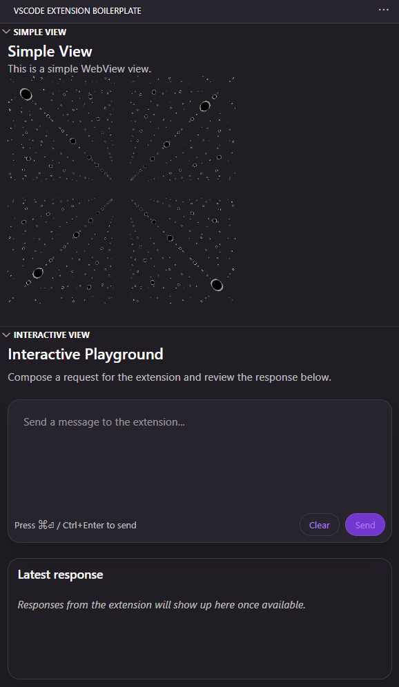

# VSCode Extension Boilerplate (React + TypeScript + Vite)

A ready-to-use boilerplate for building VSCode extensions with a React-based WebView UI, written in TypeScript, and bundled with Vite and esbuild.

This boilerplate provides a clean foundation with essential features already set up, allowing you to focus on building your extension's unique functionality.



## Features

-   **Extension & WebView:** A clear separation between the extension's backend logic and the WebView UI.
-   **React + TypeScript:** Build your UI with modern web technologies.
-   **Vite for WebViews:** Fast and efficient bundling for the WebView UI.
-   **esbuild for Extension:** Quick and lightweight bundling for the extension's main process.
-   **Sample Commands:** Includes basic commands to demonstrate functionality.
    -   `Boilerplate: Show Information`: Displays a simple information message.
    -   `Boilerplate: Reverse Selection`: Reverses the currently selected text in the editor.
-   **Sample WebViews:**
    -   **Simple View:** A static WebView that displays text and an image.
    -   **Interactive View:** A WebView that demonstrates two-way communication between the UI and the extension.
-   **Theming:** The WebView UI uses VS Code's theme variables for a consistent look and feel.
-   **Testing:** Pre-configured with Vitest for unit and integration testing.
-   **Linting & Formatting:** Integrated with Biome for code quality.

## Tech Stack

- VS Code Extension runtime powered by TypeScript and the VS Code API.
- Extension bundling handled by esbuild with incremental rebuild support.
- Webview UI built with React 18 + TypeScript and bundled via Vite.
- Styling composed with Tailwind-style utility classes defined in `webview-ui/src/app.css`.
- Quality tooling through Vitest (testing) and Biome (linting/formatting).

## Key Packages

- `esbuild`: bundles the extension runtime from `src/extension.ts` into `dist/extension.js`.
- `ultracite`: wraps Biome to apply the shared lint/format/check commands defined in project scripts.
- `@biomejs/biome`: delivers linting and formatting rules enforced across the monorepo.
- `vitest`: executes unit and integration tests for both extension and webview layers.
- `husky`: manages Git hooks to enforce linting and testing before commits.
- `tailwindcss`: provides the utility-first styling primitives referenced through `webview-ui/src/app.css`.
- `class-variance-authority`: centralizes Tailwind class variants for consistent UI theming.
- `shadcn/ui`: ships reusable headless UI components consumed from `webview-ui/src/components/ui`.
- `@radix-ui/react-slot`: underpins the composable primitives used by the shadcn/ui component layer.

## Project Structure

```
.
├── src/                          # Extension source code
│   ├── commands/                 # Sample command implementations
│   ├── providers/                # WebView providers
│   ├── utils/                    # Utility functions
│   └── extension.ts              # Main extension entry point
├── webview-ui/                   # WebView UI source code (React + Vite)
│   ├── src/
│   │   ├── components/           # React components for the views
│   │   ├── bridge/               # Communication bridge to VSCode
│   │   └── index.tsx             # UI entry point
│   └── vite.config.ts            # Vite configuration
├── package.json                  # Extension manifest and dependencies
└── ...
```

## Getting Started

### Prerequisites

-   Node.js 16+
-   VS Code 1.84.0+

### Setup

1.  Clone the repository:
    ```bash
    git clone https://github.com/atman-33/vscode-extension-boilerplate.git
    cd vscode-extension-boilerplate
    ```

2.  Install dependencies for both the extension and the webview UI:
    ```bash
    npm run install:all
    ```

### Development

-   **Run the extension in development mode:** Press `F5` in VS Code to open a new Extension Development Host window with the extension loaded.
-   **Watch for changes:** The provided launch configuration will automatically recompile the extension and webview on file changes.

## Available Scripts

-   `npm run install:all`: Installs all dependencies.
-   `npm run build`: Builds both the extension and the webview UI for production.
-   `npm run test`: Runs tests using Vitest.
-   `npm run lint`: Lints the codebase with Biome.
-   `npm run format`: Formats the codebase with Biome.
-   `npm run package`: Packages the extension into a `.vsix` file for distribution.

## How It Works

### Commands

Commands are defined in `src/commands/` and registered in `src/extension.ts`. They are also declared in `package.json` under the `contributes.commands` section.

### WebViews

The extension uses VS Code's `WebviewViewProvider` to create views in the activity bar.

1.  **Providers:** `src/providers/` contains the logic for creating and managing the webviews.
2.  **UI:** The UI for each webview is a separate React application located in `webview-ui/`.
3.  **Communication:** Messages are passed between the extension and the WebView UI using `postMessage`. The `webview-ui/src/bridge/vscode.ts` file provides a simple `vscode` object for this purpose.

## Customization

1.  **Rename the extension:** Update the `name`, `displayName`, `publisher`, and `repository` fields in `package.json`.
2.  **Add new commands:** Create new command files in `src/commands/` and register them in `extension.ts` and `package.json`.
3.  **Add new WebViews:**
    -   Create a new React component in `webview-ui/src/components/`.
    -   Add a new case in the `switch` statement in `webview-ui/src/index.tsx`.
    -   Create a new `WebviewViewProvider` in `src/providers/`.
    -   Register the provider in `extension.ts` and `package.json`.

## License

This project is licensed under the MIT License. See the [LICENSE](LICENSE) file for details.